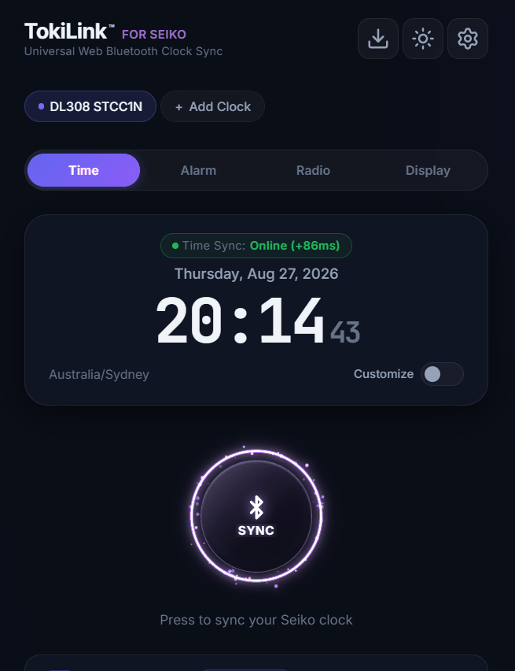

# 🕒 TokiLink for Seiko

<a href="https://midnightlogic.github.io/TokiLink/" target="_blank" rel="noopener noreferrer"></a>
<a href="https://opensource.org/licenses/Apache-2.0" target="_blank" rel="noopener noreferrer"></a>

> 🚀 **Live Web App:** <a href="https://midnightlogic.github.io/TokiLink/" target="_blank" rel="noopener noreferrer">**https://midnightlogic.github.io/TokiLink/**</a>

<p align="center">
  <a href="https://midnightlogic.github.io/TokiLink/" target="_blank" rel="noopener noreferrer">
    
  </a>
</p>

An unofficial, high-precision **Progressive Web App (PWA)** built with **Vanilla JavaScript** and the **Web Bluetooth API** to synchronize and control Bluetooth-enabled Seiko digital and analog clocks directly from any Web Bluetooth-capable browser (Chrome, Edge, Opera, Samsung Internet on Android, Windows, macOS, ChromeOS, and Linux) without requiring proprietary native mobile apps.

> [!NOTE]
> **Legal Disclaimer:** **TokiLink for Seiko** is an independent, community-driven open-source project. It is **not affiliated with, endorsed by, or sponsored by Seiko Group Corporation, Seiko Clock Inc., or any of their subsidiaries**. All trademarks, product names, and model identifiers are the property of their respective owners and are used strictly under nominative fair use for hardware compatibility and identification purposes.

---

## 🌟 Key Features

- **⚡ Zero-App Time Synchronization**: Pair and calibrate your Seiko clock directly from the web browser.
- **⏱️ Atomic NTP Time Calibration**: Pre-fetches atomic UTC time with millisecond round-trip time (RTT) offset compensation before broadcasting to the clock.
- **🌍 World Timezone Slider**: Dynamic dual-mode time controller featuring a global slider spanning **UTC−12:00 to UTC+14:00** with live city references, or manual datetime override.
- **⏰ Multi-Schedule Alarms**: Custom recurring day-of-week alarms, snooze intervals, volume control, and chime sound selection.
- **📻 FM Radio Controller**: Live FM tuning (76.0 – 108.0 MHz), seek controls, and 5 customizable radio station presets.
- **💡 Display & Audio Controls**: Multi-level display brightness adjustment, bass boost toggle, and auto power-off settings.
- **🌙 Sleep / Relaxation Timer**: Programmable sleep countdowns (15 / 30 / 60 / 90 / 120 mins) with background audio melodies.
- **📱 Installable Progressive Web App (PWA)**: Complete offline caching via Workbox Service Workers, mobile-optimized standalone layout, and Web Manifest.
- **🌐 6-Language Localization**: English (`en`), Japanese (`ja`), French (`fr`), Spanish (`es`), German (`de`), and Simplified Chinese (`zh`).

## 🌐 Browser & Platform Compatibility

Web Bluetooth (`navigator.bluetooth`) requires a secure context (HTTPS or `localhost`) and browser support:

| Platform | Supported Browsers | Status | Notes |
| :--- | :--- | :---: | :--- |
| **Android** | **Chrome**, **Edge**, **Samsung Internet**, **Opera** | ✅ **Full Support** | Native Web Bluetooth & 1-click PWA installation |
| **Android — Brave** | **Brave Browser** | ⚠️ **Flag Required** | Enable `brave://flags/#brave-web-bluetooth-api` and Relaunch |
| **Windows / macOS / Linux / ChromeOS** | **Chrome**, **Edge**, **Opera** | ✅ **Full Support** | Native Web Bluetooth. *(Tip: enable `#enable-web-bluetooth-new-permissions-backend` for 1-click zero-dialog sync)* |
| **Windows / macOS / Linux — Brave** | **Brave Browser** | ⚠️ **Flag Required** | Enable `brave://flags/#brave-web-bluetooth-api` in Brave Flags and Relaunch |
| **iOS (iPhone / iPad) — Native Safari** | **[Beacio Safari Extension](https://beacio.com/)** | ✅ **Supported in Safari + PWA** | Web Bluetooth extension for Safari. Allows **Share → Add to Home Screen** to install as a standalone PWA! |
| **iOS (iPhone / iPad) — Standalone Browser** | **[Bluefy Browser](https://apps.apple.com/app/bluefy-web-ble-browser/id1492822055)** | ✅ **Supported via App** | Zero-setup Web Bluetooth browser. Ready out-of-the-box for bookmarks. |
| **iOS (iPhone / iPad) — Default Safari** | **Safari**, **Chrome (iOS)**, **Edge (iOS)**, **Firefox (iOS)** | ❌ **No Native Bluetooth** | Apple enforces WebKit sandbox without native Web Bluetooth. Guided banner appears on launch. |

> [!TIP]
> **Using on iPhone / iPad:**
> 1. **Option 1 (Fastest Setup — Direct Browser):** Install **[Bluefy Browser](https://apps.apple.com/app/bluefy-web-ble-browser/id1492822055)** from the App Store. Tap the banner's *"Launch Bluefy"* button to open and sync immediately.
> 2. **Option 2 (Home Screen PWA Support):** Install the free **[Beacio Extension](https://beacio.com/)** and enable it in *Settings → Safari → Extensions*. You can then use native Safari and tap **Share → Add to Home Screen** to install TokiLink as a standalone offline iOS app!

> [!TIP]
> **Using on Brave Browser (Desktop & Android):**
> Brave blocks Web Bluetooth by default for privacy. To enable:
> 1. Navigate to: `brave://flags/#brave-web-bluetooth-api` and set **Web Bluetooth API** to **Enabled**.
> 2. *(Recommended)* Set **Use the new permissions backend for Web Bluetooth** (`#enable-web-bluetooth-new-permissions-backend`) to **Enabled**.
> 3. Click **Relaunch**.

> [!TIP]
> **Power User Tip (Desktop Chrome / Edge / Opera):**
> To enable true 1-click sync without repeating the browser device picker dialog on Desktop, enable `chrome://flags/#enable-web-bluetooth-new-permissions-backend`.

---

## 🏷️ Supported Clock Models

TokiLink supports a wide variety of Bluetooth-enabled Seiko digital, analog, and multi-sound clocks:

| Series / Family | Example Models | Supported Capabilities |
| :--- | :--- | :--- |
| **Series C3 Digital** | DL308K, DL307, DL306, DL305, DL208, DL207, SQ820K | High-Precision Atomic Time Synchronization |
| **AppClock Multi-Sound** | SS201, SS501, OPTEK Series | Time Sync, Multi-Alarms, FM Radio Tuning, Station Presets, Brightness, Bass Boost, Sleep Melody Timers, Auto Power-Off |
| **SSUSE Series** | SSUSE, SSUSE1, SSUSE2, SSUSE3, SSUSE4 | Time Synchronization |
| **NGAN Series** | NGAN Series Clocks | Time Synchronization |

---

## 🛠️ Architecture Overview

```
src/
├── css/
│   └── style.css            # Responsive Glassmorphic UI & Design Tokens
├── js/
│   ├── app.js               # Application Orchestrator & BLE Lifecycle Handler
│   ├── store.js             # Nano Stores Reactive Global State
│   ├── i18n.js              # Lightweight Multi-language Translation Engine
│   ├── services/
│   │   ├── bluetooth.js     # Decoupled Web Bluetooth GATT Driver
│   │   ├── platform.js      # Unified Platform & Web Bluetooth Diagnostic Service
│   │   ├── protocol.js      # Hardware Model Detectors & Packet Encoders
│   │   ├── time.js          # Atomic NTP Synchronization Engine (RTT-compensated)
│   │   └── timezones.js     # UTC-12 to UTC+14 World Timezone Dataset & Resolvers
│   └── ui/
│       ├── clockView.js     # Live Clock, Timezone Slider, & Sync Controller
│       ├── deviceView.js    # Paired Device Cards & Status Indicator Pills
│       ├── settingsView.js  # Settings Modal & Preferences
│       ├── alarmView.js     # Multi-schedule Alarms Manager
│       ├── radioView.js     # FM Radio Tuner & Station Presets
│       └── displayView.js   # Display Brightness, Bass & Sleep Timers
└── locales/                 # JSON i18n Translation Bundles (en, ja, fr, es, de, zh)
```

---

## 🚀 Getting Started

### Prerequisites
- Node.js (v18 or higher)
- A browser with Web Bluetooth enabled (Google Chrome, Microsoft Edge, Opera, or Samsung Internet)
- HTTPS or `localhost` environment (required by Web Bluetooth security policies)

### Installation & Local Development

```bash
# Clone the repository
git clone https://github.com/your-username/seiko-clock-sync.git
cd seiko-clock-sync

# Install dependencies
npm install

# Run Vite development server
npm run dev
```

### Local HTTPS Tunnel (Mobile Device Testing)

```bash
# Start Vite dev server & Cloudflare HTTPS Tunnel concurrently
npm run tunnel

# Start Production Bundle & Cloudflare Tunnel (for testing true offline PWA install on mobile)
npm run tunnel:prod
```

### Production Build & Preview

```bash
# Compile optimized production bundle with full offline PWA precache
npm run build

# Fast incremental production build
npm run build:fast

# Preview production build locally
npm run preview
```

---

## 🔒 Security & Privacy

- **100% Client-Side**: All Bluetooth GATT operations and time computations execute locally in the browser sandbox.
- **No Analytics / No Tracking**: No personal data or device MAC addresses are transmitted to external servers.
- **NTP Time Provider**: Uses public privacy-friendly atomic time endpoints (`timeapi.io` / `worldtimeapi.org`) strictly for drift offset calibration.

---

## 📄 License & Trademark Notice

- **Software License:** Apache License, Version 2.0. Copyright © 2026 MidnightLogic. Developed for the open-source and smart home horology community.
- **Trademark Notice:** Seiko®, AppClock, and related model designations (DL308, SS201, SS501, etc.) are registered trademarks of Seiko Group Corporation / Seiko Clock Inc. This software is an independent third-party implementation.
